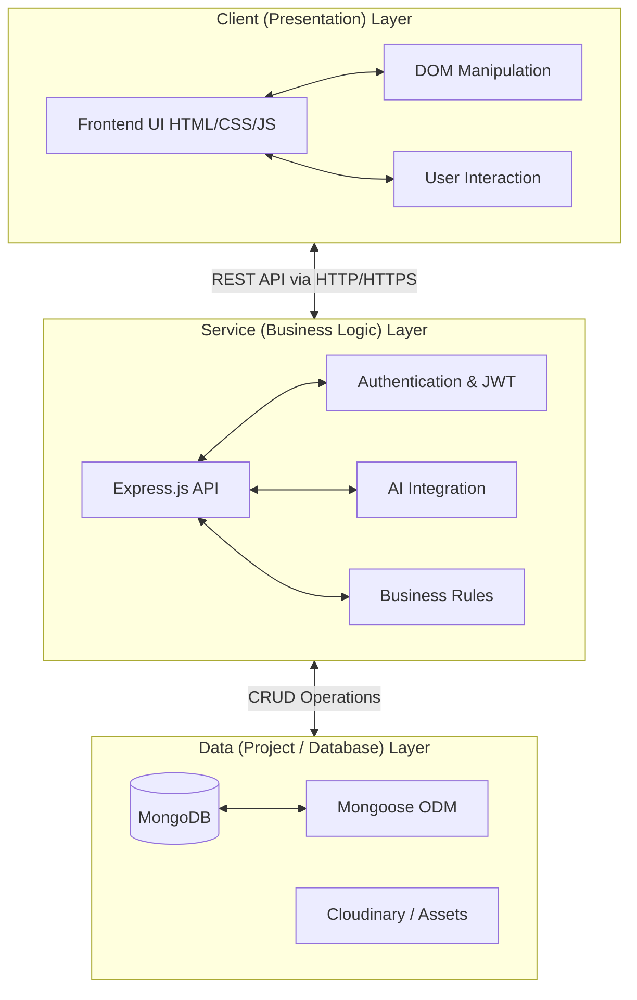

# Software Requirements Specification (SRS)
## For Real Estate Marketplace Platform

**Version:** 1.0
**Date:** March 2026

---

## 1. Introduction

### 1.1 Purpose
The purpose of this document is to specify the software requirements for the "Real Estate Marketplace Platform." It serves as a comprehensive guide for developers, project managers, and stakeholders to understand the system's intended capabilities, features, and constraints.

### 1.2 Document Conventions
- **User:** Refers to any individual interacting with the platform.
- **Buyer:** A user looking to purchase or rent properties.
- **Seller/Agent:** A user listing properties for sale or rent.
- **Admin:** A user with full system management privileges.

### 1.3 Intended Audience
This SRS is intended for the development team, QA testers, database administrators, and project stakeholders.

### 1.4 Product Scope
The Real Estate Marketplace Platform is a web-based application designed to bridge the gap between property buyers, sellers, and agents. The system not only features standard listing management, filtering, and role-based access control, but uniquely integrates advanced AI features (via OpenAI) to provide price predictions, smart property recommendations, AI-generated property descriptions, and market analysis.

---

## 2. Overall Description

### 2.1 Product Perspective
The platform acts as a standalone web application built on the MERN/Node.js stack (MongoDB, Express.js, Node.js with Vanilla JS Frontend). It interfaces with external services including Cloudinary (for image hosting), OpenAI (for artificial intelligence features), and SMTP servers (for email notifications).

### 2.2 Product Functions
- **Authentication & Authorization:** Secure registration, login, and JWT-based session management across roles.
- **Property Management:** Complete CRUD (Create, Read, Update, Delete) operations for real estate listings.
- **Advanced Searching & Filtering:** Dynamic search functionality filtering by price, location, parameters, and radius.
- **AI Core Features:** 
  - AI Price Predictor (estimates property value based on trends)
  - Smart Recommendations Engine
  - AI Description Generator
  - Natural Language Tour Assistant (Chat)
  - Market Analysis
- **User Profiling:** Manage favorites, search history, and user preferences.
- **Email Notifications:** Automated welcome emails and alerts.

### 2.3 User Classes and Characteristics
1. **Buyers:** General users who can browse, filter, favorite properties, and use AI chatbots and predictors.
2. **Sellers/Agents:** Authorized to create and manage their property listings, upload images, and view engagement metrics.
3. **Administrators:** Oversee platform operation, manage users, delete inappropriate listings, and monitor system health.

### 2.4 Operating Environment
- **Backend:** Node.js environment (v16.20.1 or higher)
- **Database:** MongoDB (Local or Atlas)
- **Frontend:** Modern web browsers (Chrome, Firefox, Safari, Edge)
- **Deployment:** Cloud hosting platforms (e.g., AWS, Heroku)

### 2.5 System Architecture
The application follows a structured 3-tier architecture:
- **Client (Presentation) Layer:** The frontend interface built with HTML, CSS, and Vanilla JavaScript. Handles user interactions, DOM manipulation, and dynamic rendering of modals and properties.
- **Service (Business Logic) Layer:** The Express.js backend API that processes requests, enforces role-based access control, communicates with the AI suite, and handles business rules.
- **Data (Project / Database) Layer:** The MongoDB database managed via Mongoose, storing users, properties, favorites, and application state.

### 2.6 Middleware Architecture
The Express.js backend utilizes a structured middleware pipeline to intercept and process HTTP requests before routing them to controller functions. Key middleware components include:

- **Authentication Middleware (`authMiddleware`):** Extracts and verifies JSON Web Tokens (JWT) from the `Authorization` header. If valid, it attaches the user payload to the request object (`req.user`); if missing or invalid, it returns a `401 Unauthorized` error.
- **Role-Based Authorization Middleware (`roleMiddleware`):** Evaluates the authenticated user's role (e.g., `Buyer`, `Seller`, `Admin`) against the required roles for a specific route. Disallows access and returns a `403 Forbidden` error if the user lacks the necessary permissions.
- **File Upload Middleware (`multer`):** Parses `multipart/form-data` to handle image uploads for property listings before passing the request to Cloudinary integration.
- **Error Handling Middleware:** A centralized catch-all mechanism that formats unhandled exceptions or failed promises into standardized JSON error responses to prevent app crashing.

### 2.7 Service Architecture
The application logic is compartmentalized into discrete service controllers responsible for orchestrating business operations:
- **Authentication Service:** Manages user registration, login, token generation (JWT), and password hashing using bcrypt.
- **Property Service:** Encapsulates CRUD operations for properties, handling listing logic, property state (availability), and counting metrics.
- **AI Integration Service:** Serves as a unified wrapper for interacting with the OpenAI API. Responsible for prompt engineering, caching responses (where applicable), parsing structural output, and graceful fallbacks if the external service fails.
- **Third-Party Integrations Service:** Orchestrates communication with Cloudinary (for Media mapping) and SMTP servers (via Nodemailer) for email delivery.

---

## 3. System Features

### 3.1 Account Management & Authentication
- **Description:** Users can create an account as a buyer or seller. Passwords must be hashed using `bcrypt` and authenticated using JWT.
- **Requirements:**
  - Standard user registration with role assignment.
  - Email notification dispatched successfully upon registration.
  - Login system generating a JWT valid for 30 days.

### 3.2 Property Listing Management
- **Description:** Sellers can add listings with detailed attributes.
- **Requirements:**
  - Multi-image upload support with `Multer` locally and offloaded to `Cloudinary`.
  - Properties must include: Title, Price, Location, Type, Bedrooms, Bathrooms, Area, and Amenities.
  - System tracking for "View Count" and "Favorite Count".

### 3.3 Search and Filter Engine
- **Description:** Buyers must be able to locate specific properties easily.
- **Requirements:**
  - Real-time location autocomplete suggestions.
  - Filter parameters: Minimum & Maximum Budget, Property Type, Radius.

### 3.4 Artificial Intelligence Suite
- **Description:** Integration with OpenAI API to enhance user experience.
- **Requirements:**
  - **Price Prediction Mode:** Accepts area variables and outputs a forecasted price range with confidence levels.
  - **Recommendations:** Analyzes user history/preferences and suggests high-matching properties.
  - **Virtual Assistant:** A conversational UI capable of answering context-aware questions about real estate and individual properties.

---

## 4. External Interface Requirements

### 4.1 User Interfaces
- **Responsive Design:** HTML/CSS frontend optimized for Desktop, Tablet, and Mobile views.
- **Interactive Modals:** Registration, Login, and AI features to be handled largely through DOM Modals for seamless UX.
- **Dark/Light Mode:** Integrated theme toggling utilizing localStorage.

### 4.2 Software Interfaces
- **Database:** MongoDB accessed via `Mongoose` ODM.
- **Cloudinary API:** For real-time media uploads, transformations, and retrievals.
- **OpenAI API (GPT-3.5-turbo):** For resolving prompt-driven real estate requests.
- **SMTP/Nodemailer:** For out-bound transactional emails.

### 4.3 Communications Interfaces
- The web application communicates with the web server using standard HTTP/HTTPS protocols via RESTful JSON APIs.
- Endpoints are grouped into modules: `/api/auth`, `/api/properties`, `/api/users`, `/api/location`, and `/api/ai`.

---

## 5. Non-Functional Requirements

### 5.1 Performance Requirements
- **Latency:** API responses for standard database queries should be resolved under 500ms.
- **AI Throughput:** OpenAI features may take up to 2-4 seconds; loading indicators must be presented to the user.

### 5.2 Security Requirements
- **Data Protection:** Passwords securely hashed; database keys mapped via `.env` files dynamically.
- **Access Control:** Middleware guards on routes (`authMiddleware`, `roleMiddleware`) to prevent unauthorized actions (e.g., a buyer attempting to edit a listing).

### 5.3 Reliability & Availability
- Platform to be designed with fault tolerance, specifically around 3rd-party APIs (fallback text if OpenAI is down).

### 5.4 Maintainability
- Monolithic Model-View-Controller (MVC) architectural pattern ensures organized directory trees.

---
*Generated for the Real Estate Marketplace Platform.*
